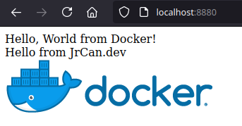

# Hello web : the simpliest web application for docker !

## build the application

In the directory ``php-helloworld-docker``

```
docker build . -t php-test
```
Will build an image tagged ``php-test``.

You can list your images with

```
docker image ls .
```

You should have something like this :
```
REPOSITORY                 TAG               IMAGE ID       CREATED          SIZE
php-test                   latest            be8436ad762b   57 seconds ago   368MB
```


## Run the application

```
docker run -p 8880:80 --rm --name my_container -d php-test 
```

Note: the --rm option will destroy the container when you will stop it.

Check your docker is running
```
docker ps
```

Open your browser on : http://localhost:8880/

## result 



## stop the container

```
docker stop my_container
```

## build and run with docker-compose with Traefik

```
docker-compose up -d
```
